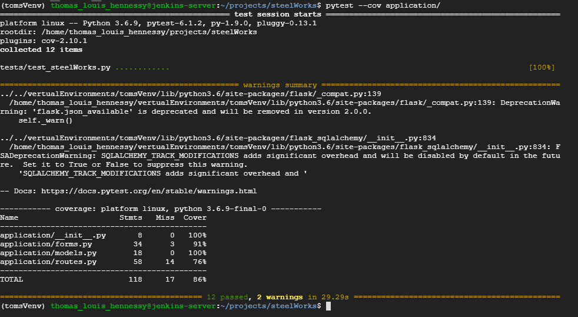
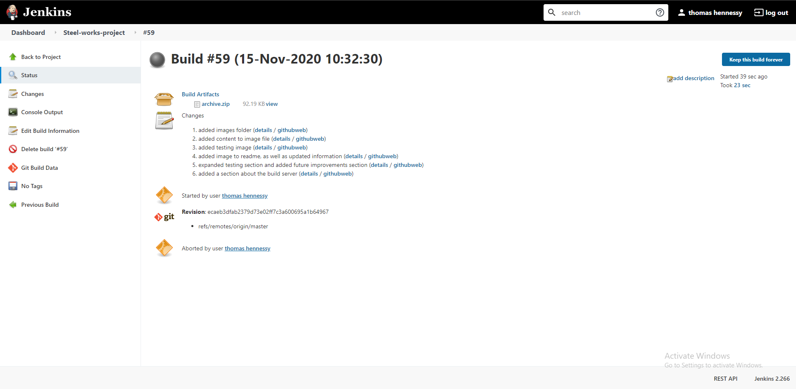

# steelWorks

This application is a very simple flask web app which stores information about songs and user reviews of those songs. Songs can be added, viewed, edited and deleted. Reviews can be added to a song, viewed and deleted. Progress on the development of the project can be found on the steelWorks [trello](https://trello.com/b/p4Kncors/steel-works-product-backlog) board.

## App usage

### Songs

 - Add a song: On the home screen, click the add song button and fill out the relevant details.
 - View a song: Go to the home page and find the desired song and click the view information button.
 - Edit a song: When viewing a songs information, click the edit song button and edit the desired fields.
 - Delete song: When viewing a songs information, click the delete song link. When a song is deleted, all associated reviews will also be deleted.
### Reviews

 - To add a review: go to the information page for the song and click add a review. Fill in the information requested.
 - To view a review: got to the information page for the song reviewed by the review, it will be found below the songs information.
 - To delete a review: go to the review and click the delete review button

### Validation

 - When entering a score in to a review, the score can only be 1 - 10
 - A large number of fields must be filled in when adding a review/song
 - A selection of special characters are not be allowed

## Tools

This application has used the following tools during development:

 - Flask
 - Python
 - PYTest
 - PYTest-cov
 - WTForms
 - Google cloud platform
 - SQL
 - SQLAlchemy
 - Jenkins
 - Gunicorn

### Required installations

The dependencies required for the application can be installed using [pip](https://pip.pypa.io/en/stable/) in conjunction with the requirements document.
`pip install -r requierments.txt`
Additionally, python3 will need to be installed.

## Accessing the website

The website is accessible via Gunicorn via the IP address and port number of the virtual machine. The website is launched via a script within the repository.
`bash launchGunicorn.sh`
Once the script is run, the application will be accessible from the local host on port 5000.

## Testing

The application is tested using unit tests. The tests currently cover 86% of the code written for this application, as determined by pyTest-cov The coverage is shown by the image at the bottom of this section. The environment setup for the unit tests allow them to connect to the same SQL server the live application connects to. The test covers the init, forms, models and routes files. Templates are out of scope for Unit testing due to their primarily graphical purpose, though connections to the pages are tested.

### Testing coverage

## Build server

The application is run on a Jenkins server obtaining the source code via GitHub. The server takes the source code, ensures it can be run and produces a software artefact in the form of a build of the software.

### Build server

## Future improvements

 1. The website would benefit from CSS stylings to improve the layout and readability
 2. Adding sanitization to inputted video URL's would allow users to input the first URL to the video they find, making the website easier to use.
 3. Adding a user feature so that added reviews can be contributed to a person.
 4. After the build server ensures the application is able to run, it should automatically stop the application rather than needing manual intervention.

